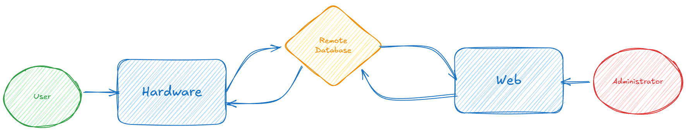
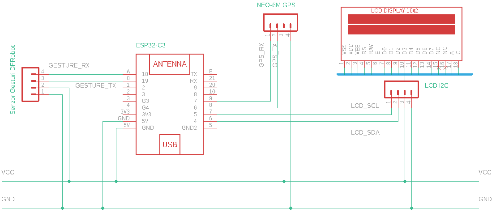

# Sistem Inteligent de Localizare și Control prin Gesturi

## Introducere

Ascensiunea IoT a permis monitorizarea și interacțiunea de la distanță cu dispozitivele fizice în moduri fără precedent. Acest proiect implementează un **Sistem Inteligent de Localizare și Control prin Gesturi** utilizând un microcontroller ESP32-C3. Sistemul combină urmărirea GPS în timp real cu controlul intuitiv prin gesturi, stabilind o legătură între interacțiunile fizice locale și stocarea datelor în cloud prin Firebase. Acest sistem demonstrează integrarea protocoalelor de comunicație multiple într-o soluție embedded coerentă.

## Context

În sistemele moderne de gestionare a flotelor și vehicule inteligente, există o nevoie tot mai mare de dispozitive care nu doar monitorizează locația, dar permit și șoferilor sau operatorilor să semnalizeze actualizări de stare fără interfețe complexe. Butoanele tradiționale pot fi greoaie; controlul prin gesturi "touchless" oferă o alternativă mai sigură și mai modernă. În plus, transmisia fiabilă a datelor către cloud este esențială pentru monitorizarea de la distanță. Acest proiect răspunde acestor nevoi prin prototiparea unui dispozitiv care urmărește locația și răspunde la mișcările mâinii pentru a declanșa alerte vizuale, simulând un sistem pentru vehicule de urgență sau utilitare.

## Descrierea Proiectului

Obiectivul acestui proiect este construirea unui sistem embedded conectat care:
1.  **Monitorizează Locația**: Achiziționează continuu date de latitudine și longitudine de la un modul GPS.
2.  **Recunoaște Gesturi**: Detectează mișcările mâinii pentru a controla indicatorii de stare **TBD**.
3.  **Oferă Feedback Vizual**: Utilizează un LED RGB și un ecran LCD pentru a oferi feedback imediat utilizatorului.
4.  **Sincronizare Cloud**: Încarcă datele de locație în timp real într-o bază de date Google Firebase Realtime Database pentru vizualizare de la distanță.

Dispozitivul funcționează autonom, conectându-se la o rețea Wi-Fi specificată și gestionând concurent intrările de la senzori.

## Arhitectură

### Prezentare Generală a Sistemului

Sistemul este construit în jurul **ESP32-C3**, un SoC low-cost, low-power, cu Wi-Fi și Bluetooth integrate. Acesta acționează ca unitate centrală de procesare, agregând datele de la senzorii GPS și de Gesturi.
-   **Intrare**: 
    + [NEO-6M GPS](https://randomnerdtutorials.com/guide-to-neo-6m-gps-module-with-arduino/)
    + [Senzor Gesturi DFRobot](https://wiki.dfrobot.com/Gesture%20%26%20Touch%20Sensor%20V1.0%20SKU:%20SEN0285)
-   **Procesare**:
    + [ESP32-C3](https://documentation.espressif.com/esp32-c3-mini-1_datasheet_en.pdf)
-   **Ieșire**:
    + [LCD I2C](https://randomnerdtutorials.com/esp32-esp8266-i2c-lcd-arduino-ide/)
    + LED RGB
    + [Firebase](https://firebase.google.com/docs)
    + [Web View](TDB TODO)

### Hardware
*   **Microcontroller**: ESP32-C3 DevKitM-1 (Arhitectură RISC-V).
*   **Modul GPS**: NEO-6M (comunică prin UART).
    *   *Configurație*: Conectat la Hardware Serial (Pinii 6 TX / 7 RX).
*   **Senzor Gesturi**: DFRobot Gesture Touch (comunică prin UART).
    *   *Configurație*: Conectat la Software Serial (Pinii 18 RX / 19 TX).
*   **Afișaj**: LCD 1602 cu Modul I2C.
    *   *Configurație*: SDA (Pin 4), SCL (Pin 5).
*   **Indicator**: LED RGB NeoPixel (Pin 8).
*   **Alimentare**: USB / 3.3V Logic.

### Software
Firmware-ul este dezvoltat în **C++** utilizând ecosistemul **PlatformIO** cu framework-ul Arduino. Bibliotecile și modulele cheie includ:
*   **TinyGPSPlus**: Pentru parsarea propozițiilor NMEA de la modulul GPS.
*   **DFRobot_Gesture_Touch**: Pentru interpretarea fluxurilor de date binare de la senzorul de gesturi.
*   **Firebase ESP Client**: Pentru autentificare securizată și trimiterea datelor JSON către Firebase Realtime Database.
*   **LiquidCrystal_I2C**: Pentru controlul afișajului.
*   **SoftwareSerial**: Pentru crearea unei interfețe UART secundare pe pinii GPIO.

**Detalii de Implementare:**
*   **Rezolvarea Conflictelor Serial**: ESP32-C3 are resurse UART hardware limitate. GPS-ul este prioritizat pe Hardware Serial (remapat pe pinii 6/7) pentru fiabilitate. Senzorul de gesturi utilizează un port serial emulat software pe pinii 18/19.
*   **Logică Non-Blocantă**: Funcția `loop()` este proiectată pentru a gestiona interogarea senzorilor la frecvență înaltă, gestionând în același timp sarcinile de rețea la frecvență joasă (actualizări Firebase la fiecare 5 secunde) fără a bloca execuția.

## Rezultate
TODO

## Concluzii
TODO

## Referințe

1.  **Espressif Systems**: [ESP32-C3 Datasheet](https://www.espressif.com/en/products/socs/esp32-c3)
2.  **PlatformIO**: [Documentație](https://docs.platformio.org/)
3.  **DFRobot**: [Wiki Senzor Gesturi](https://wiki.dfrobot.com/)
4.  **TinyGPS++ Library**: [GitHub Repository](https://github.com/mikalhart/TinyGPSPlus)
5.  **Firebase**: [Documentație Realtime Database](https://firebase.google.com/docs/database)